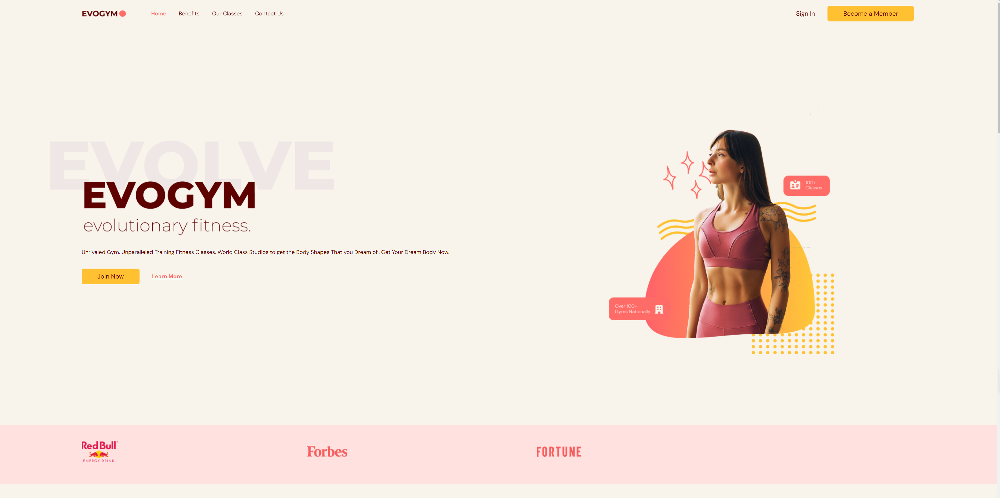
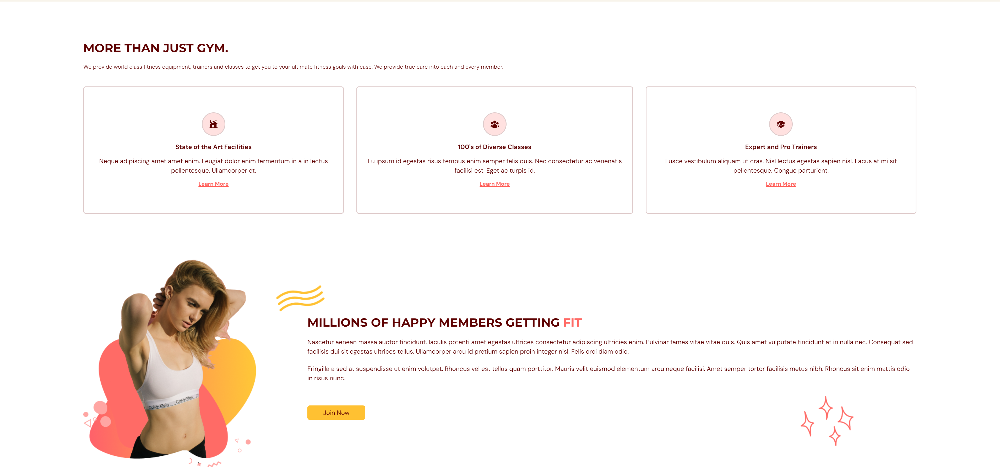
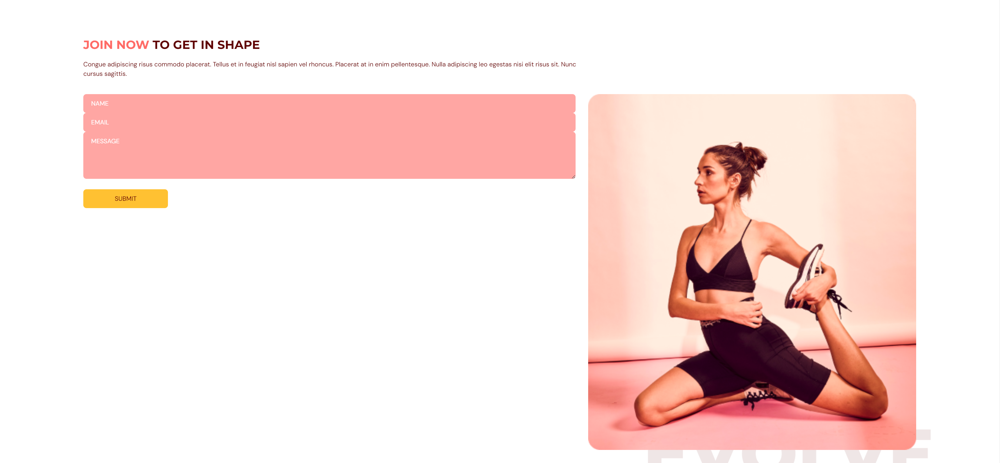

# TypeScript Fitness Application

This repository contains a TypeScript fitness application with a modern frontend and robust backend integration.

## Screenshot







## Frontend

The frontend of the application is built using the following technologies:
- **React**: A JavaScript library for building user interfaces.
- **TypeScript**: A typed superset of JavaScript that compiles to plain JavaScript.
- **Vite**: A fast build tool and development server.
- **Tailwind CSS**: A utility-first CSS framework for rapid UI development.
- **Hero Icons**: A set of free, MIT-licensed high-quality SVG icons for you to use in your web projects.
- **Framer Motion**: A library for creating animations and gestures.
- **FormSubmit**: A simple service for handling form submissions.
- **React Anchor Link Smooth Scroll**: A React component for smooth scrolling between anchor links.

The frontend is hosted on an AWS S3 bucket.

## Backend

The backend integration includes:
- **API Gateway**: A fully managed service that makes it easy for developers to create, publish, maintain, monitor, and secure APIs.
- **AWS Lambda**: A compute service that lets you run code without provisioning or managing servers.
- **DynamoDB**: A key-value and document database that delivers single-digit millisecond performance at any scale.
- **SES (Simple Email Service)**: A cloud-based email sending service designed to help digital marketers and application developers send marketing, notification, and transactional emails.

## Features

- **Smooth Animations**: Utilizes Framer Motion to create fluid animations.
- **Responsive Design**: Built with Tailwind CSS to ensure the application looks great on all devices.
- **Efficient User Engagement**: Integrated various tools and services to enhance user interaction and experience.

## Setup and Deployment

### Prerequisites

- Node.js
- AWS account

### Frontend Setup

1. Clone the repository:
    ```sh
    git clone git@github.com:Soymilk1006/Gym_Frontend.git
    cd your-repo
    ```

2. Install the dependencies:
    ```sh
    npm install
    ```

3. Start the development server:
    ```sh
    npm run dev
    ```

### Backend Setup

1. Set up AWS services (API Gateway, Lambda, DynamoDB, SES) as per your application requirements.
2. Deploy your Lambda functions and configure API Gateway to route requests to them.
3. Ensure your S3 bucket is set up for static website hosting and the frontend build is deployed to the bucket.

### Deployment

1. Build the frontend application:
    ```sh
    npm run build
    ```

2. Deploy the build to your AWS S3 bucket:
    ```sh
    aws s3 sync dist/ s3://your-bucket-name --delete
    ```

## Contact

For any questions or feedback, please reach out to [devon.li.devops@gmail.com](mailto:devon.li.devops@gmail.com).
